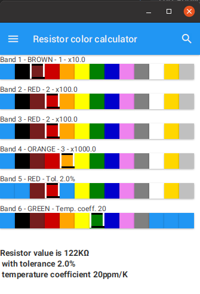
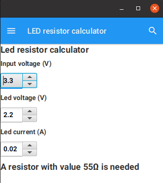

# Resistor calculator application for mobile phone and desktop


## Based on

* The Maven library [Resistor calculator](https://github.com/FDelporte/ResistorCalculator)
* Existing JavaFX project of my book ["Getting started with Java on Raspberry Pi"](https://webtechie.be/books/), 
which contains a JavaFX application for desktop only: ["Example application: visualize the Raspberry Pi pins with JavaFX"](https://github.com/FDelporte/JavaOnRaspberryPi/tree/master/Chapter_02_Tools/javafx-resistors)
* Starter application "Gluon Mobile - Multi View Project"
 
Gluon Mobile Applications are Java applications written in JavaFX. These applications ensure that developers can create high performance, great looking, and cloud connected mobile apps from a single Java code base.

### Screens and functionalities

The application provides two views.

#### Calculate the value of a resistor based on the color bands



#### Calculate the required resistor value for a LED in an electronics project



## Pre-requisites

Please checkout the prerequisites to run this application as a Maven project [at the Gluon website](https://github.com/gluonhq/client-maven-plugin#requirements).

## How to use on development PC

> **Note**: The following are command line instructions. For IDE specific instructions please checkout
[IDE documentation](https://docs.gluonhq.com/#getting-started-ide-plugins) of the client plugin.

These applications can run on the JVM on desktop platforms. To run the application, execute the following command:

```
mvn javafx:run
```

The same application can also run natively on any targeted OS, including Android, iOS, Linux, Mac and Windows.

To create a native image, execute the following command:

```
mvn client:build client:run
```

> **Note**: The above client commands are target-platform dependent and might change depending on the platform.
For more details, please check
[Client Maven Goals](https://github.com/gluonhq/client-maven-plugin#2-goals).

## GitHub Actions

Seperate GitHub Actions files are included with this project:

* [maven-ios.yml](.github/workflows/maven-ios.yml): creates iPhone app, not fully working in this repository as no 
Apple developer secrets and other required settings are available here. But you can use this as a reference how to set this up.
* [maven-macos.yml](.github/workflows/maven-macos.yml): creates MacOS executable.
* [maven-ubuntu-linux.yml](.github/workflows/maven-ubuntu-linux.yml): creates JAR and native Linux x64 application.
* [maven-ubuntu-android.yml](.github/workflows/maven-ubuntu-android.yml): creates Android APK application.
* [maven-windows.yml](.github/workflows/maven-windows.yml): creates Windows x64 executable.

## Configuration

To configure the client plugin, please checkout the [Configuration documentation](https://docs.gluonhq.com/client/#_configuration).

## More information

Here are some helpful links:

* [Gluon Client documentation](https://docs.gluonhq.com/client)
* [Gluon Mobile documentation](https://docs.gluonhq.com/mobile)
* [Client Maven Plugin](https://github.com/gluonhq/client-maven-plugin)
* [Client Gradle Plugin](https://github.com/gluonhq/client-gradle-plugin)

# https://github.com/marketplace/actions/setup-msbuild
# https://github.com/microsoft/setup-msbuild
# https://docs.gluonhq.com/#_windows
# https://help.github.com/actions/language-and-framework-guides/building-and-testing-java-with-maven
