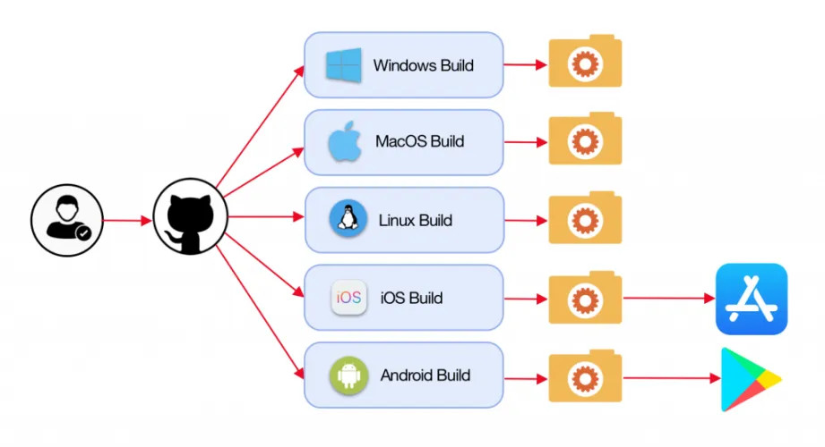
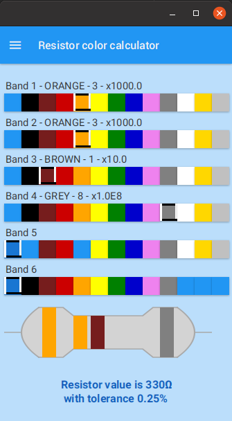
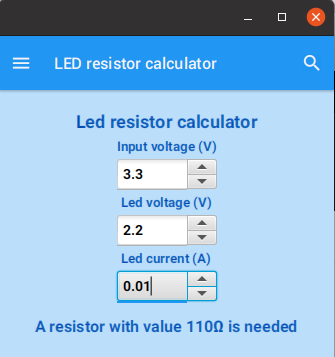

# Resistor calculator application for mobile phone and desktop


## About the application

Proof-of-concept application created with JavaFX as a true "write once, run everywhere".
Uses Gluon tools and GitHub actions to build native applications for all platforms.



For more info, check these posts which describe the full flow in detail:

* [Building native applications for all PC and mobile platforms from a single JavaFX project with Gluon Mobile and GitHub Actions (webtechie.be)](https://webtechie.be/post/2020-11-24-javafx-gluon-mobile-github-actions/)
* [Use GitHub Actions to automate your Gluon build and release cycle (gluonhq:com)](https://gluonhq.com/use-github-actions-to-automate-your-gluon-build-and-release-cycle/)

### Based on

* The Maven library [Resistor calculator](https://github.com/FDelporte/ResistorCalculator) 
as described on ["Resistor color codes and calculations as a Java Maven library"](https://webtechie.be/post/2019-11-25-resistor-color-codes-and-calculations-a-java-maven-library/).
and ["Calculating resistor value with a JavaFX application"](https://webtechie.be/post/2019-11-27-calculating-resistor-value-with-a-javafx-application/).
* Existing JavaFX project of my book ["Getting started with Java on Raspberry Pi"](https://webtechie.be/books/), 
which contains a JavaFX application for desktop only:
["Example application: visualize the Raspberry Pi pins with JavaFX"](https://github.com/FDelporte/JavaOnRaspberryPi/tree/master/Chapter_02_Tools/javafx-resistors)
* Starter application "Gluon Mobile - Multi View Project" with 
[the Gluon plugin in IntelliJ IDEA](https://plugins.jetbrains.com/plugin/7864-gluon) 
as described on ["Starting a JavaFX Project with Gluon Tools" (foojay.io)](https://foojay.io/today/starting-a-javafx-project-with-gluon-tools/).
 
Gluon Mobile Applications are Java applications written in JavaFX. These applications ensure that developers can create high performance, great looking, and cloud connected mobile apps from a single Java code base.

### Get the app

This application is published to the [Google Play](https://play.google.com/store/apps/details?id=be.webtechie.resistorcalculatorapp)
and [Apple App Store](https://apps.apple.com/us/app/gluon-resistor-calculator/id1540638756) from [the fork on GluonHQ](https://github.com/gluonhq/ResistorCalculatorApp) 


### Screens and functionalities

The application provides two views.

#### Calculate the value of a resistor based on the color bands



#### Calculate the required resistor value for a LED in an electronics project



## Pre-requisites

Please checkout the prerequisites to run this application as a Maven project [at the Gluon website](https://github.com/gluonhq/client-maven-plugin#requirements).

## How to use the code on development PC

> **Note**: The following are command line instructions. For IDE specific instructions please checkout
[IDE documentation](https://docs.gluonhq.com/#getting-started-ide-plugins) of the client plugin.

These applications can run on the JVM on desktop platforms. To run the application, execute the following command:

```
mvn javafx:run
```

The same application can also run natively on any targeted OS, including Android, iOS, Linux, Mac and Windows.

To create a native image, execute the following commands (Use sdkman - https://sdkman.io/):

```
sdk install java 21.0.0.r11-grl
export GRAALVM_HOME=${SDKMAN_CANDIDATES_DIR}/java/21.0.0.r11-grl
echo $GRAALVM_HOME
mvn gluonfx:build gluonfx:run
```

> **Note**: The above client commands are target-platform dependent and might change depending on the platform.
For more details, please check
[Client Maven Goals](https://github.com/gluonhq/client-maven-plugin#2-goals).

## GitHub Actions

Separate GitHub Actions files are included in this repository:

* [maven-ios.yml](.github/workflows/maven-ios.yml): creates iPhone app, not fully working in this repository as no 
Apple developer secrets and other required settings are available here. But you can use this as a reference how to set this up.
* [maven-macos.yml](.github/workflows/maven-macos.yml): creates MacOS executable.
* [maven-ubuntu-linux.yml](.github/workflows/maven-ubuntu-linux.yml): creates JAR and native Linux x64 application.
* [maven-ubuntu-android.yml](.github/workflows/maven-ubuntu-android.yml): creates Android APK application.
* [maven-windows.yml](.github/workflows/maven-windows.yml): creates Windows x64 executable.

## Configuration

To configure the client plugin, please checkout the [Configuration documentation](https://docs.gluonhq.com/client/#_configuration).

## Gradle

Use Gradle to build native image:

	./gradlew build nativeCompile nativeLink
	
Executable found in `build/client/XXXX/resistor-calculator-app`

## More information

Here are some helpful links:

* [Gluon documentation website](https://docs.gluonhq.com)
* Gluon on GitHub: [Client Maven Plugin](https://github.com/gluonhq/client-maven-plugin) and [Client Gradle Plugin](https://github.com/gluonhq/client-gradle-plugin)
* [GitHub: Building and testing Java with Maven](https://help.github.com/actions/language-and-framework-guides/building-and-testing-java-with-maven)
